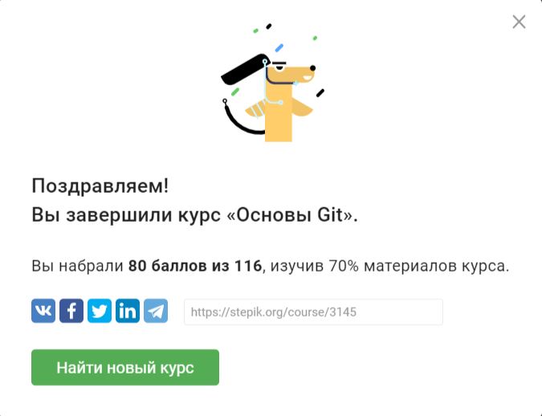

# Kuznetsov-UPP
<h1>Инвариантная самостоятельная 1.1</h1>
Прохождение электронного дистанционного курса по работе с системой контроля версий Git. Сертификат о прохождении (или иные результаты прохождения) опубликовать в портфолио. Можно использовать любой доступный курс на платформах Stepic, Coursera, Sololearn и т.д. Рекомендуется, https://stepik.org/course/3145 (индивидуально).

<h1>Инвариантная самостоятельная 1.2</h1>  	
Анализ подходов и инструментов планирования и анализа временных затрат, а также способов визуализации (например, диаграмма Ганта, диаграмма сгорания задач, покер планирования и т.д.). Создание сравнительной таблицы с обзором особенностей, достоинств и недостатков. (можно выполнять в группе).
<a href="https://docs.google.com/document/d/1kVDyFpYU5GcAUvKJiuEE0rF1EujizaRto0TniOJq6r0/edit?usp=sharing">Результат</a>
<h1>Вариативная самостоятельная 1.2</h1>
<h1>Инвариантная самостоятельная 2.1</h1>
Создание интеллект-карты на тему «Программная инженерия. Модели и методологии разработки» (выделение подсистем и связей между ними). (можно выполнять в группе). 
<a href="https://coggle.it/diagram/Yd8tq5tkwkvDxV2p/t/%D0%BA%D1%83%D0%B7%D0%BD%D0%B5%D1%86%D0%BE%D0%B2-%D0%BC-%D1%81-%D0%BC%D0%BE%D0%B4%D0%B5%D0%BB%D0%B8-%D0%B8-%D0%BC%D0%B5%D1%82%D0%BE%D0%B4%D0%BE%D0%BB%D0%BE%D0%B3%D0%B8%D0%B8/4a3a3865487f6f73fcaed909aba3af3d96a27c53a23386c27e7170ae9c2eed7a">Результат</a>
<h1>Инвариантная самостоятельная 2.2</h1>
Исследование функциональности инструмента для прототипирования интерфейсов Figma или Affinity Designer. Анализ расширений для веб-разработчика (например, для автоматического преобразования верстки в код). Создание текстового отчета. (можно выполнять в группе).
<a href="https://docs.google.com/document/d/129cMNsfqLajLe2irDlZICnlBl7SEC6S2fRuBp7LutS4/edit?usp=sharing">Результат</a>
<h1>Инвариантная самостоятельная 2.3</h1>
 Анализ современных платформ для деплоя статического и динамического контента. Создание сравнительной таблицы с характеристикой и обзором особенностей (например, repl.it, netlify, heroku, vercel, github pages, azure). Создание текстового отчета (возможно, в табличном виде). (можно выполнять в группе).
<a href="https://docs.google.com/document/d/1ljPmYnMt476wAvI-HvobfwKjNWWUcfeDfrQduGof-x8/edit?usp=sharing">Результат</a>
<h1>Вариативная самостоятельная 2.2</h1>
Обзор и исследование функциональности системы управления проектами JetBrains YouTrack. Создание фрагмента ЭОР. (индивидуально).
<a href="https://docs.google.com/document/d/1lpOWNN1-MvxW5vq-Yhmv7gwwsaTeNCgFnbnoYzvH1mk/edit?usp=sharing">Результат</a>
<h1>Инвариантная самостоятельная 3.1</h1>
<h1>Вариативная самостоятельная 3.2</h1>
